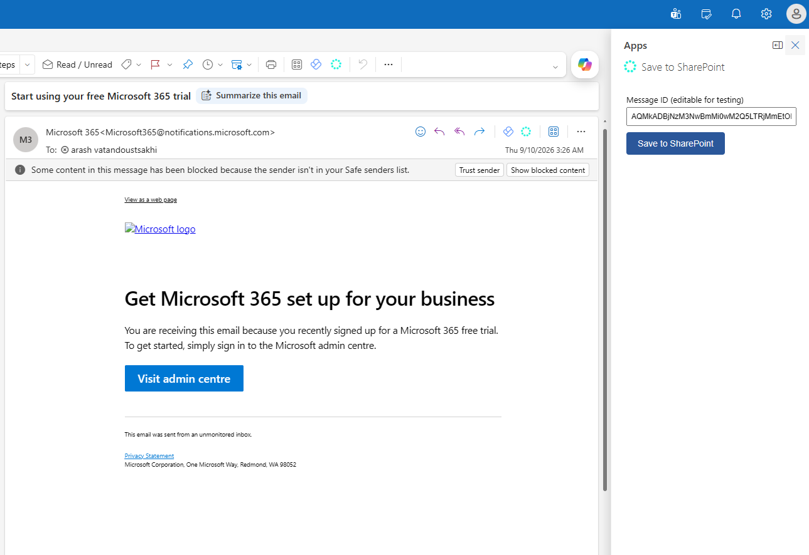
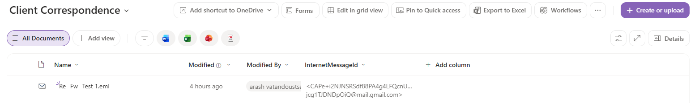
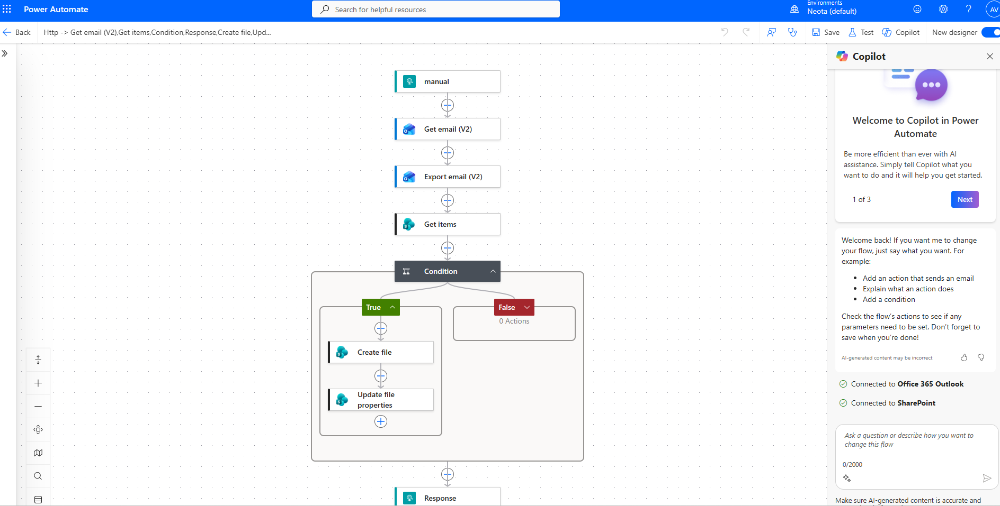

# Outlook → SharePoint Email Archiving — Build Notes

## What this does

Two paths, one destination:

-   **Automatic (built previously in another flow)**: new email arrives → Power Automate exports it → saved to SharePoint.
-   **Manual (retry/backfill)**: lawyer opens an email, clicks "Save to SharePoint" in a custom Outlook button → same save logic runs on demand. (Outlook Addin)

with a duplicate check so re-running never creates a second copy of the same email.  (works by InternetMessageID)

----------

## SharePoint destination

-   One document library (e.g. "Client Correspondence") with a **single line of text** column, `InternetMessageId`, used purely for the dedupe check.

----------

## The manual retry flow

Trigger: **"When a HTTP request is received"** (the built-in `Request` connector — not the Outlook/SharePoint connectors).

**Why this instead of a button inside the Outlook ribbon that runs a flow directly**: that native mechanism was removed from current Outlook. The supported route now is a real Add-in with a command button that calls an HTTP endpoint.

**Licensing note**: this trigger is documented as a built-in/non-premium connector, but some tenants restrict or hide it via DLP policy or a limited seeded license — if it's missing entirely or greyed out, that's a tenant-level decision (usually a security-conscious one, since an HTTP trigger creates an open webhook URL), not something fixable from the flow editor. Workaround if truly blocked: swap the "front door" to a SharePoint list trigger ("When an item is created") instead — the Add-in writes a row to a small request list rather than calling a webhook, at the cost of the Add-in needing Graph write access instead of a simple flow URL.

**Response step**: added after the Condition (not inside only the "Yes" branch) so the caller — the Add-in — always gets an answer, whether the email was newly saved or already existed. Without this, a duplicate-detection case would leave the button's fetch() call hanging indefinitely.

----------

## The Outlook Add-in (manifest.xml + taskpane.html)

**Why an Add-in, and not Adaptive Cards / Actionable Messages**: Adaptive Cards in Outlook are for  interactive content embedded in an email someone sends you approve/reject buttons on a notification email, for example. They have no mechanism to attach a button to an _already-received, arbitrary_ email, nor to run logic like "check SharePoint for duplicates" or "export the full message with attachments." An Office Add-in command button is the only supported way to inject custom UI into the reading pane of an existing message — this is why the design uses one instead.

**Hosting**: Add-ins must be served over HTTPS from a real domain — this cannot be sideloaded from a local file. `GitHub Pages` was used here as a free, fast option for demo purposes.

**Gotcha — version mismatch**: the base manifest's `<Requirements><Sets>` block and the `VersionOverrides` section's `DefaultMinVersion` must agree, or Outlook rejects install with a min-API-requirement error. Both are set to 1.3 here — plenty for the two APIs actually used (`item.itemId`, `convertToRestId`).

**Debug aid**: the message ID field in the task pane is an editable text box, pre-filled with the auto-detected ID but overridable.

----------

## Security note: why a message ID from one account can't leak into another

Message IDs (both the Outlook REST-style ID and the Internet Message ID header) are meaningful only _within the context of the specific mailbox and account they came from_. The Get email / Export email actions run using whatever account is signed into the flow's Office 365 connection — if a message ID from a different mailbox or tenant is passed in, that connection has no access to look it up, and the API rejects it (this is what produced the misleading "shared mailbox" error during testing, in one case). In practice, this means the system can't be tricked into pulling someone else's email into SharePoint just by knowing or guessing an ID string — the ID alone carries no access; the API call is authorized by the connection's own sign-in, every time.

----------
## Notes
- How to install: Go to **https://aka.ms/olksideload** - this opens Outlook on the web and, after a few seconds, pops up the "Add-Ins for Outlook" dialog. Outlook on the web opens, then the Add-Ins for Outlook dialog appears after a few seconds. In that dialog, select My add-ins etc. Scroll to the Custom Addins section at the bottom → Add a custom add-in → Add from File. The Custom Addins section is at the bottom of the dialog box; select the Add a custom add-in link, and then select Add from File. Pick the manifest.xml I gave you and accept the prompts.
- **Alternatively:** Use company wide app permission. Under Admin > Cloud > Microsoft > Settings > IntegratedApps > Upload Custom apps
- **GitHub Page:** Repo Settings → Pages → Source: Deploy from branch → main / root → Save.
- **Manisfest uses the https url**
https://arash-afk.github.io/Microsoft-Outlook-addin/[xyz].html
-- Microsoft-Outlook-addin: repository Name
-- arash-afk: Username
